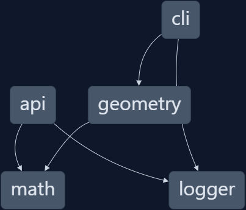

<p align="center"></p>

<div align="center">

# Go Nx Plugin — Playground

**A full overview of what [nx-go](https://github.com/nx-go/nx-go) can do for you!**

✨ This workspace has been generated by [Nx, Smart Monorepos · Fast CI.](https://nx.dev) ✨

</div>

---

## Project graph

Run `pnpm nx graph` to show the graph of the workspace.
It will show tasks that you can run with Nx.



[Learn more about Exploring the Project Graph](https://nx.dev/core-features/explore-graph)

## Generate code

If you happen to use Nx plugins, you can leverage code generators that might come with it.

Run `nx list` to get a list of available plugins and whether they have generators. Then run `nx list <plugin-name>` to see what generators are available.

Learn more about [Nx generators on the docs](https://nx.dev/features/generate-code).

## Running tasks

To execute tasks with Nx use the following syntax:

```
nx <target> <project> <...options>
```

You can also run multiple targets:

```
nx run-many -t <target1> <target2>
```

..or add `-p` to filter specific projects

```
nx run-many -t <target1> <target2> -p <proj1> <proj2>
```

Targets can be defined in the `package.json` or `projects.json`. Learn more [in the docs](https://nx.dev/features/run-tasks).
